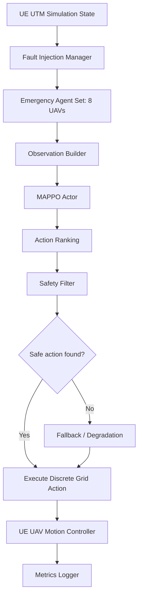

# UE-MAPPO Emergency Recovery Interface Design

## 1. Background and Scope

This document defines the initial interface design for integrating the MAPPO emergency recovery policy into the UE-based UTM simulation system. The intended deployment scenario is not to replace the centralized LaCAM-UTM planner during normal operation. Instead, LaCAM-UTM remains the nominal global planner when communication with the UTM command center is available. MAPPO is introduced as a short-horizon emergency recovery module for a local communication failure event.

In the planned experiment, UE injects a fault at a specified simulation time. Exactly eight UAVs are selected as failed agents. After the fault is injected, these eight UAVs can no longer receive or execute new path commands from the UTM planner. They must switch to a decentralized emergency recovery loop driven by the trained MAPPO actor. Other non-failed UAVs continue executing their original UTM paths and are treated as RID-observed dynamic traffic by the emergency module.

The first implementation should keep the problem as close as possible to the current MAPPO training environment. Positions are represented as discrete grid cells. The GPS-to-grid conversion is intentionally omitted from the first integration experiment; UE should provide RID neighbor positions directly as grid coordinates. The action space remains the seven discrete actions used in training:

```text
WAIT, +X, -X, +Y, -Y, +Z, -Z
```

The primary purpose of the interface is to evaluate whether a MAPPO-based emergency recovery module can maintain safety and restore a stable state after local UTM communication failure. The deployable system candidate is MAPPO with a safety filter and degradation logic. The raw MAPPO-only mode is included only as an ablation baseline.

## 2. System Modes for Experiment Comparison

The experiment should compare four emergency behaviors under the same injected fault conditions.

**Mode 0: No Emergency Recovery.** After communication failure, the failed UAVs execute a minimal default behavior such as holding position. This mode provides the failure lower bound and answers what happens if no recovery module is available.

**Mode 1: Rule-Based Local Avoidance.** The failed UAVs use deterministic local rules. A typical baseline is greedy movement toward the assigned recovery target, followed by safety filtering against grid boundaries, static obstacles, no-fly zones, Vertex conflicts, Edge conflicts, and Downwash conflicts. If the greedy action is unsafe, the controller tries backup actions in a fixed priority order or waits.

**Mode 2: MAPPO Only.** Each failed UAV builds its local observation and executes the highest-probability MAPPO action directly. This mode is not recommended for deployment because a neural policy can propose unsafe actions. It is useful as an ablation to quantify the value of explicit safety filtering.

**Mode 3: MAPPO with Safety Filter and Degradation.** MAPPO produces an ordered preference over the seven discrete actions. The safety filter checks candidate actions in descending probability order and executes the first safe action. If no safe candidate exists, the UAV waits. If the agent remains blocked or repeatedly requires fallback, the controller degrades to a rule-based strategy or a conservative hold state. This is the intended deployable emergency mode.

The normal LaCAM-UTM result should also be recorded as a reference upper bound, but it should not be counted as an emergency mode. The emergency module is evaluated under the assumption that the failed UAVs cannot keep receiving centralized path updates.

## 3. Runtime Architecture

The runtime architecture should separate state conversion, policy inference, safety verification, and fallback control. This keeps the neural policy from being the sole authority for safety-critical decisions.



At each emergency decision step, UE provides the current grid state of the eight failed UAVs, their recovery targets, local RID neighbor positions, static map constraints, and no-fly-zone state. The MAPPO actor returns action probabilities. The safety filter checks the proposed actions before UE applies them.

## 4. Fault Injection and Agent Ownership

At simulation time `t_fault`, UE creates a fixed emergency group:

```text
EmergencyAgents = {uav_1, ..., uav_8}
```

Only these agents are controlled by MAPPO during the emergency episode. All other UAVs continue using the nominal UTM plan and should not be overwritten by the emergency controller. However, they must still be visible to the emergency module as dynamic traffic through RID observations.

For each failed UAV, the recovery module should track:

```text
agent_id
mission_id
current_cell
previous_cell
last_action
recovery_target_cell
recent_path_history
emergency_step_index
consecutive_wait_count
consecutive_filter_reject_count
fallback_state
```

The `recovery_target_cell` can initially be the original mission goal, because the current MAPPO model was trained to move from start to goal. A later extension can replace this with a generated emergency safe holding cell or a communication recovery point.

## 5. Observation Builder Contract

The Observation Builder is responsible for reconstructing the exact observation format expected by the trained MAPPO actor. This is the most important integration requirement. If UE builds observations differently from the Python training environment, model performance will degrade even when the policy checkpoint is correct.

The current MAPPO observation has dimension 645 when `observation_radius=2`. It consists of a 20-dimensional state vector and a 5-channel local grid with shape `5 x 5 x 5 x 5`.

```text
obs_dim = state_dim + local_channels * local_side^3
        = 20 + 5 * 5^3
        = 645
```

The state vector contains the following fields:

| Segment | Dimension | Meaning |
| --- | ---: | --- |
| Normalized current cell | 3 | `(x, y, z)` scaled to `[-1, 1]` by grid dimensions |
| Goal delta | 3 | `(goal - current) / grid_dimensions` |
| Remaining Manhattan distance | 1 | Distance to target divided by `sum(grid_dimensions)` |
| Reached-goal flag | 1 | `1` if the agent has reached the target, otherwise `0` |
| Normalized time step | 1 | `time_step / max_time_steps` |
| Priority/history features | 4 | normalized mission id, round-robin rank, wait streak, oscillation streak |
| Last action one-hot | 7 | one-hot over `{WAIT, +X, -X, +Y, -Y, +Z, -Z}` |

The local grid uses five channels inside a cubic neighborhood centered on the agent:

| Channel | Meaning |
| ---: | --- |
| 0 | Static blocked cells and out-of-bounds cells |
| 1 | Cells that will be inside a no-fly zone at the next decision step |
| 2 | Other UAV body occupancy from RID/local state |
| 3 | The agent's target cell if it is inside the local window |
| 4 | Self center marker |

For the first UE integration, RID neighbor positions should be inserted into channel 2 as occupied body cells. RID input should include both other failed UAVs and nearby normal UAVs that remain on the UTM plan. The first implementation can use current RID positions only. Future versions may add one-step predicted occupancy for normal UAVs if UE has access to their next planned cell.

## 6. Input and Output Message Shapes

The following message shapes are proposed for the first prototype. They are written in JSON-like form for clarity. The actual transport can be a Python socket service, gRPC, shared memory, or an ONNX Runtime C++ call.

### 6.1 Emergency Step Request

```json
{
  "episode_id": "ue_run_0001",
  "time_step": 128,
  "grid_dimensions": [100, 100, 10],
  "max_time_steps": 240,
  "observation_radius": 2,
  "failed_agents": [
    {
      "agent_id": "uav_17",
      "mission_id": 1,
      "current_cell": [12, 35, 4],
      "previous_cell": [11, 35, 4],
      "goal_cell": [90, 35, 4],
      "last_action": "+X",
      "recent_path": [[10, 35, 4], [11, 35, 4], [12, 35, 4]]
    }
  ],
  "rid_neighbors": [
    {
      "agent_id": "uav_23",
      "cell": [14, 35, 4],
      "is_failed_agent": false
    }
  ],
  "blocked_cells_local_or_global": [[20, 20, 3]],
  "no_fly_zones": [
    {
      "zone_id": 1,
      "min_cell": [40, 40, 2],
      "max_cell": [45, 45, 3],
      "start_time_step": 100,
      "end_time_step": 160,
      "enabled": true
    }
  ]
}
```

For efficiency, the production implementation should not send a large global list of blocked cells every step if the map is static. Static map and corridor data should be loaded once at emergency-module initialization. Per-step messages should send only dynamic agent states and active temporal no-fly updates.

### 6.2 Emergency Step Response

```json
{
  "episode_id": "ue_run_0001",
  "time_step": 128,
  "actions": [
    {
      "agent_id": "uav_17",
      "selected_action": "+X",
      "raw_policy_action": "+X",
      "raw_policy_probs": {
        "WAIT": 0.01,
        "+X": 0.82,
        "-X": 0.00,
        "+Y": 0.12,
        "-Y": 0.03,
        "+Z": 0.02,
        "-Z": 0.00
      },
      "safety_filter_status": "accepted",
      "fallback_used": false,
      "degradation_state": "normal"
    }
  ],
  "timing_ms": {
    "observation_build": 0.30,
    "policy_inference": 0.45,
    "safety_filter": 0.20,
    "total": 0.95
  }
}
```

The response should always include both the raw MAPPO action and the final selected action. This makes it possible to compute how often the safety filter changed the neural policy output.

## 7. Safety Filter

The safety filter is a deterministic check applied after MAPPO inference and before UE executes an action. It should use the same simplified conflict model as the current MAPPO environment:

```text
Vertex conflict: two UAV bodies occupy the same cell at the next step.
Edge conflict: two UAVs swap cells across the same edge in one step.
Downwash conflict: one UAV occupies the cell directly below another UAV.
```

Static checks must include:

```text
Grid boundary
Static obstacle occupancy
Corridor or allowed-airspace mask, if enabled in UE
Temporal no-fly zone at next time step
```

For MAPPO-controlled failed agents, the filter should evaluate the joint action set, because actions that are individually valid can still create Vertex, Edge, or Downwash conflicts with each other. For non-failed RID neighbors, the first prototype can treat their current cells as occupied and optionally apply a conservative buffer if future motion is unknown.

Action selection should follow this sequence:

```text
1. Sort the seven actions by MAPPO probability for each failed agent.
2. Try the highest-probability joint action.
3. If conflicts exist, replace unsafe actions with each agent's next-best candidate.
4. If no valid candidate is found within a small search budget, choose WAIT for blocked agents.
5. If WAIT also creates a safety issue, trigger degradation.
```

The prototype can begin with per-agent greedy filtering. A later version should use a small joint-action search for the eight failed UAVs to avoid local ordering artifacts.

## 8. Degradation Logic

The degradation module defines what happens when MAPPO cannot provide a safe and useful recovery action. It should be explicit and logged.

Suggested degradation triggers:

| Trigger | Meaning |
| --- | --- |
| `filter_reject_count >= N` | MAPPO repeatedly proposes unsafe actions |
| `consecutive_wait_count >= N` | The UAV is blocked for too long |
| `unsafe_hold_count >= N` | Environment repeatedly holds the UAV for safety |
| `inference_timeout` | Model service does not respond within the control deadline |
| `invalid_observation` | UE cannot build a valid 645-dimensional observation |
| `out_of_distribution_state` | Optional future detector for unusual states |

Suggested degradation actions:

```text
Level 0: MAPPO normal mode.
Level 1: MAPPO with stricter safety filter and stronger preference for WAIT.
Level 2: Rule-based local avoidance.
Level 3: Conservative hold / emergency hover.
Level 4: Reconnect to UTM planner when communication is restored.
```

The exact thresholds should be part of the experiment configuration. For example, a first prototype may set `N=5` for repeated filter rejection and `N=20` for consecutive waits.

## 9. Deployment Options

Two deployment paths are recommended.

**Prototype path: Python inference service.** UE sends emergency-step requests to a Python process that loads the PyTorch MAPPO checkpoint and returns selected actions. This is fastest to implement and easiest to debug because it reuses the current Python model code and observation checks. It is suitable for early UE experiments and metric collection.

**Production-like path: ONNX Runtime in UE C++.** The actor network is exported to ONNX and loaded by UE C++ through ONNX Runtime. UE builds the 645-dimensional observation directly and receives action logits or probabilities. This removes Python IPC overhead and gives more reliable latency measurements. Safety filtering and degradation should remain in UE C++ even if model inference is externalized.

The first integration milestone should use the Python service. Once the interface is stable and the experiment modes are validated, the actor can be exported to ONNX.

## 10. Metrics and Logging

Each emergency episode should log both per-step and per-episode metrics.

Per-step logs:

```text
episode_id
time_step
agent_id
current_cell
goal_cell or recovery_target_cell
raw_policy_action
raw_policy_probs
selected_action
safety_filter_status
fallback_used
degradation_state
RID neighbor count
observation_build_ms
policy_inference_ms
safety_filter_ms
total_decision_ms
```

Per-episode metrics:

| Metric | Meaning |
| --- | --- |
| Trigger-to-action latency | Time between fault injection and first emergency action |
| Time to safe state | Steps required until all failed UAVs are conflict-free and stable |
| Minimum separation | Minimum body/downwash separation over the emergency episode |
| Vertex conflict count | Number of same-cell conflicts |
| Edge conflict count | Number of swap conflicts |
| Downwash conflict count | Number of downwash conflicts |
| Corridor violation count | Number of corridor or allowed-airspace violations |
| No-fly violation count | Number of temporal no-fly violations |
| Recovery success rate | Fraction of episodes that reach the recovery success condition |
| Degradation trigger rate | Fraction of agents or episodes requiring fallback |
| Mean policy inference time | Average neural inference time per decision step |
| Mean total decision time | Observation build + inference + filter + fallback |

The recovery success condition should be defined before experiments. A practical first definition is: all eight failed UAVs reach their assigned recovery targets or remain in a conflict-free stable state before the emergency horizon ends, with zero no-fly/corridor violations and no unresolved dynamic conflicts.

## 11. Integration Milestones

**Milestone 1: Offline interface replay.** Export UE-like scenario snapshots from Python or UE and verify that the Observation Builder produces the same 645-dimensional observations as the Python MAPPO environment for matching states.

**Milestone 2: Python service prototype.** Run UE with fault injection and call a Python MAPPO service for the eight failed agents. Log raw actions and filtered actions, but keep the safety filter simple.

**Milestone 3: Four-mode experiment.** Compare no recovery, rule-based local avoidance, MAPPO only, and MAPPO with safety filter and degradation on the same fault seeds.

**Milestone 4: Safety filter refinement.** Replace greedy filtering with a small joint-action filter for the eight failed UAVs. Add explicit degradation logs and thresholds.

**Milestone 5: ONNX/UE C++ inference.** Export the actor and move inference into UE C++ if latency and deployment realism become important.

## 12. Open Design Questions

Several decisions should be finalized before implementation.

First, the recovery target needs to be fixed. Continuing to the original mission goal is closest to current training. Moving to a temporary safe holding cell may better match emergency recovery, but it requires new target generation and potentially new training data.

Second, the treatment of non-failed UAVs needs to be chosen. The simplest version uses current RID positions only. A more conservative version reserves their current cell and nearby cells for one or more steps. If UE can expose their next planned cell without violating the emergency information assumptions, the safety filter can check one-step Edge conflicts more accurately.

Third, the action execution period must be aligned with the MAPPO discrete step. If UE physics runs at a higher frequency than MAPPO decisions, one MAPPO action should correspond to a fixed-duration movement from one grid cell to a neighboring grid cell.

Fourth, the safety filter must define whether it checks only the eight failed agents or all visible RID neighbors jointly. The deployable version should at least protect against current-cell conflicts with normal UAVs and all pairwise conflicts among failed UAVs.

Fifth, the fallback strategy should be selected based on the experiment goal. If the experiment is safety-first, conservative hold is acceptable. If the experiment values mission continuation, rule-based local avoidance should be the primary fallback.

## 13. Recommended First Implementation

The recommended first implementation is a Python inference service with UE-side safety filtering. UE injects an eight-UAV failure, builds observations using direct grid-cell RID data, sends the observation batch to Python, receives action probabilities, and applies the safety filter before commanding movement. The experiment should start with the four-mode comparison and record the metrics listed above.

The initial model should be the current strongest general checkpoint:

```text
models/utm8_100x100_obs_mappo_ft2_deadlock
```

The Stage C `static_anchor_ft2` model can be evaluated as an additional candidate, but current results show only marginal improvement on low-density temporal no-fly scenarios. Therefore, it should not replace the Stage B model until UE-side experiments show a consistent benefit.
